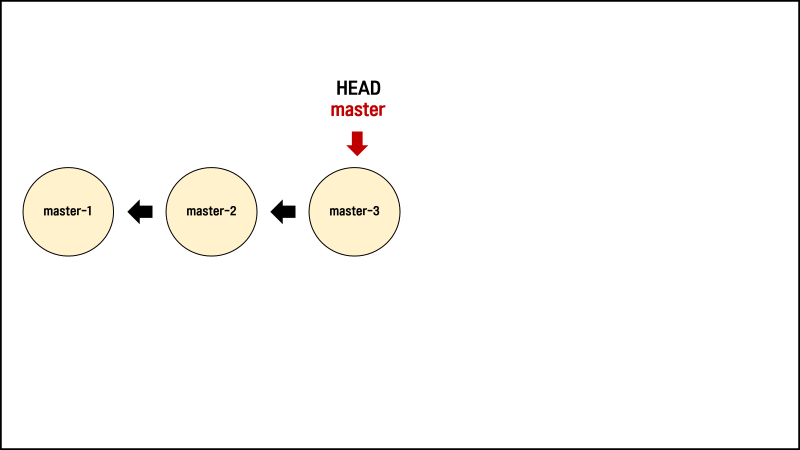
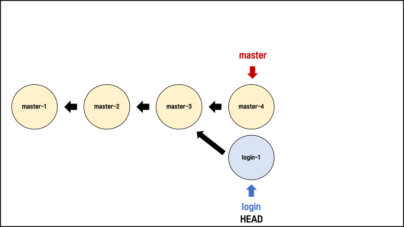

[toc]

---

## Branch

> 나뭇가지처럼 여러 갈래로 작업 공간을 나누어 독립적으로 작업할 수 있도록 도와주는 Git의 도구
>
> https://git-scm.com/book/en/v2/Git-Branching-Branches-in-a-Nutshell


- 개발을 하다 보면 코드를 여러 개로 복사해야 하는 일이 자주 생기는데, 코드를 통째로 복사하고 나서 원래 코드와는 상관없이 독립적으로 개발을 진행할 수 있도록 도움


**장점**

1. 독립 공간을 형성하기 때문에 원본(master)에 대해 안전
2. 하나의 작업은 하나의 브랜치로 나누어 진행되므로 체계적인 개발이 가능
3. 특히나 Git의 브랜치는 매우 가벼우며 순식간에 브랜치를 새로 만들고 브랜치 사이를 이동할 수 있음


**브랜치를 꼭 써야할까?**

1. master(main) 브랜치는 상용을 의미합니다. 그래서 언제든 세상에 공개되어 있습니다.
2. 만약 상용에 에러가 있어서 고쳐야 한다면 어떻게 해야할까요?
3. 고객들이 사용하고 있는데, 함부로 버전을 되돌리거나 삭제할 수 있을까요?
4. 따라서 브랜치를 통해 별도의 작업 공간을 만들고, 그곳에서 되돌리거나 삭제합니다.
5. 브랜치는 완전하게 독립이 되어있어서 어떤 작업을 해도 master에는 영향을 끼치지 못합니다.
6. 그리고 이후에 에러를 해결했다면? 그 내용을 master에 반영할 수도 있습니다.

<br>

---

<br>

### Branch command

#### `git branch`

> 브랜치 조회, 생성, 삭제 등 브랜치와 관련된 Git 명령어

```bash
# 브랜치 목록 확인
$ git branch

# 원격 저장소의 브랜치 목록 확인
$ git branch -r

# 새로운 브랜치 생성
$ git branch <브랜치 이름>

# 특정 브랜치 삭제
$ git branch -d <브랜치 이름> # 병합된 브랜치만 삭제 가능
$ git branch -D <브랜치 이름> # (주의) 강제 삭제 (병합되지 않은 브랜치도 삭제 가능)
```

<br>

#### `git switch`

> “Switch branches” 
>
> - 현재 브랜치에서 다른 브랜치로 `HEAD`를 이동시키는 명령어 
> - 2019년 8월 git 2.23 버전에서 출시
> 
>https://git-scm.com/docs/git-switch
> 
>[https](https://github.blog/2019-08-16-highlights-from-git-2-23/)[://github.blog/2019-08-16-highlights-from-git-2-23/](https://github.blog/2019-08-16-highlights-from-git-2-23/)

> `HEAD`
>
> - 현재 브랜치를 가리키는 포인터

```bash
# 다른 브랜치로 이동
$ git switch <다른 브랜치 이름>

# 브랜치를 새로 생성과 동시에 이동
$ git switch -c <브랜치 이름>

# 특정 커밋 기준으로 브랜치 생성과 동시에 이동
$ git switch -c <브랜치 이름> <커밋 ID>
```


**git switch 주의사항**

> “git switch 하기 전에, **Working Directory 파일이 모두 버전 관리가 되고 있는지** 반드시 확인해야 한다.

1. master 브랜치와 feature 브랜치가 있다고 가정해보자.
2. feature 브랜치에서 `test.txt` 를 만들고 `git add` 하지 않은 상태에서 
   `git switch master`를 하면 어떤 일이 발생할까?
3. feature 브랜치에서 만들었던 `test.txt`가 master 브랜치에도 똑같이 생성된다.

- **“왜 그럴까?”**

1. Git의 브랜치는 독립적인 작업 공간을 가지지만, 어디까지나 Git이 관리하는 파일 트리에 한해서임
2. git add를 하지 않은, 즉 Staging Area에 한 번도 올라가지 않은 새 파일은 
   Git의 버전 관리를 받고 있지 않기 때문에 브랜치가 바뀌더라도 계속 유지되는 것
3. 따라서 반드시 git switch를 하기 전에는 모든 워킹 디렉토리의 파일이 버전 관리가 되고 있는지 확인해야 함


---


## Branch scenario

> `git branch`와 `git switch`를 통해 브랜치를 조회, 생성, 이동하기

### (1) 사전 세팅

1. 홈 디렉토리에 `git-branch-practice` 폴더를 생성하고 이동 후 vscode를 실행합니다.

   ```bash
   $ mkdir git-branch-practice
   $ cd git-branch-practice
   $ code .
   ```

2. Git 저장소를 생성합니다.

   ```bash
   $ git init
   Initialized empty Git repository in C:/Users/kyle/git-branch-practice/.git/
   ```

3. `test.txt`를 생성하고 각각 master-1, master-2, master-3 이라는 내용을 순서대로 입력하여 커밋 3개를 작성합니다.

   ```bash
   $ touch test.txt
   
   # test.txt에 master-1 작성
   $ git add .
   $ git commit -m "master-1"
   
   # test.txt에 master-2 작성
   $ git add .
   $ git commit -m "master-2"
   
   # test.txt에 master-3 작성
   $ git add .
   $ git commit -m "master-3"
   ```

4. `git log --oneline`을 입력했을 때 아래와 같이 나와야 정상입니다.
   총 3개의 버전이 master 브랜치에 만들어졌습니다.

   ```bash
   $ git log --oneline
   0604dcd (HEAD -> master) master-3
   9c22c89 master-2
   3d71510 master-1
   ```

5. 현재까지의 결과

   

    > 커밋 진행 방향과 화살표 표기 방향이 다른 이유
    >
    > - 커밋은 이전 커밋 이후에 변경사항만을 기록한 것이므로 이전 커밋에 종속되어 생성될 수 밖에 없기 때문에 일반적으로 화살표 방향을 이전 커밋을 가리키도록 표기


### (2) 브랜치 생성 및 조회

1. 현재 위치(master 브랜치의 최신 커밋)에서 login이라는 이름으로 브랜치를 생성합니다.

   ```bash
   $ git branch login
   ```

2. login브랜치가 잘 생성되었는지 확인합니다.
   
   > `* master`의 의미는 현재 HEAD가 가리키는 브랜치는 `master` 라는 뜻
   
   ```bash
   $ git branch
     login
   * master
   ```
   
3. `git log --oneline`을 입력했을 때 아래와 같이 나와야 정상입니다.
   `0604dcd` 커밋 기준으로 `master`와 `login`브랜치가 위치한 것을 볼 수 있습니다.

   ```bash
   $ git log --oneline
   0604dcd (HEAD -> master, login) master-3
   9c22c89 master-2
   3d71510 master-1
   ```

4. `master` 브랜치에서 1개의 커밋을 더 작성합니다.

   ```bash
   # test.txt에 master-4 작성
   $ git add .
   $ git commit -m "master-4"
   ```

5. 현재 브랜치와 커밋의 상태 확인

   ```bash
   $ git log --oneline
   5ca7701 (HEAD -> master) master-4
   0604dcd (login) master-3
   9c22c89 master-2
   3d71510 master-1
   ```

6. 현재까지의 결과

   


### (3) 브랜치 이동

1. 현재 브랜치와 커밋의 상태는 다음과 같습니다.

   ```bash
   $ git log --oneline
   5ca7701 (HEAD -> master) master-4
   0604dcd (login) master-3
   9c22c89 master-2
   3d71510 master-1
   ```

2. 이때 login브랜치로 이동하면 어떤 일이 일어날까요?

   ```bash
   $ git switch login
   ```

3. master 브랜치의 test.txt에 작성한 master-4가 지워졌습니다.

   ```bash
   # login 브랜치의 test.txt 모습
   
   master-1
   master-2
   master-3
   ```

4. 그리고 `git log --oneline`을 입력하면 아래와 같이 나타납니다.
   이제 `HEAD`는 `login` 브랜치를 가리키고, `master` 브랜치가 보이지 않습니다.

   ```bash
   $ git log --oneline
   0604dcd (HEAD -> login) master-3
   9c22c89 master-2
   3d71510 master-1
   ```

5. master 브랜치는 삭제된 걸까요?
   아닙니다. 브랜치를 조회 해보면 다음과 같이 나타납니다.
   HEAD가 `login` 브랜치를 가리키면서, log도 `login` 브랜치 기준으로 보이는 것이었습니다.

   ```bash
   $ git branch
   * login
     master
   ```

6. `git log --oneline --all`을 입력하면 모든 브랜치의 로그를 볼 수 있습니다.

   ```bash
   $ git log --oneline --all
   5ca7701 (master) master-4
   0604dcd (HEAD -> login) master-3
   9c22c89 master-2
   3d71510 master-1
   ```

7. 현재까지의 결과

   

    > 즉, 브랜치를 이동한다는건 HEAD가 해당 브랜치를 가리킨다는 것을 의미하고, 
    >
    > 브랜치는 최신 커밋을 가리키므로, HEAD가 해당 브랜치의 최신 커밋을 가리키게 됩니다. 
    >
    > 따라서 워킹 디렉토리의 내용도 HEAD가 가리키는 브랜치의 최신 커밋 상태로 변화합니다.


### (4) login 브랜치에서 커밋 생성

1. test.txt 파일에 login-1이라고 작성합니다.

   ```bash
   # login 브랜치의 test.txt
   master-1
   master-2
   master-3
   login-1
   ```

2. 추가적으로 test_login.txt도 생성하고 login-1이라고 작성해봅시다.

   ```bash
   $ touch test_login.txt
   
   # 이후 test_login.txt에 작성
   login-1
   ```

3. 커밋을 생성합니다.

   ```bash
   $ git add .
   $ git commit -m "login-1"
   ```

4. `git log --oneline --all --graph`를 통해 아래와 같은 내용을 확인합니다.
   `master` 브랜치와 `login` 브랜치가 다른 갈래로 갈라진 것을 확인할 수 있습니다.

   ```bash
   $ git log --oneline --graph --all
   * 3b0a091 (HEAD -> login) login-1
   | * 5ca7701 (master) master-4
   |/
   * 0604dcd master-3
   * 9c22c89 master-2
   * 3d71510 master-1
   ```

5. 현재까지의 결과

   
